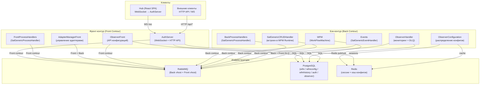
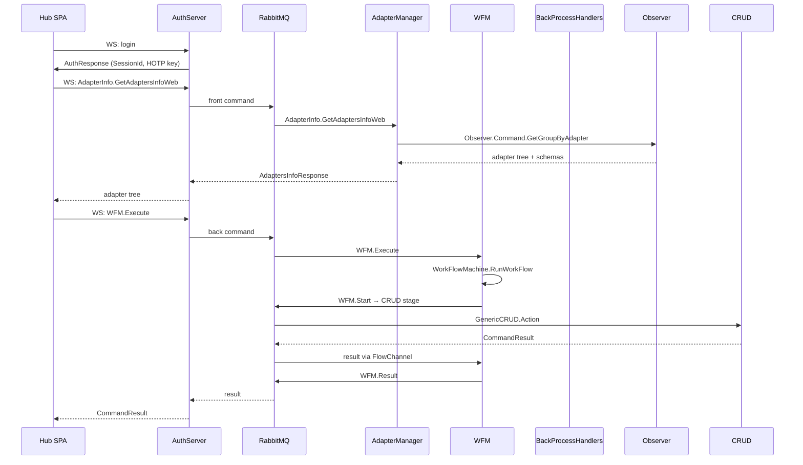

# Архитектура SAL3 / WFM Экосистемы

> Максимально полное описание инфраструктуры бэкенда и фронтенда для контекста агентов.
> Дата: 2026-04-27

---

## 1. Общий обзор

Экосистема состоит из **микросервисов** и **библиотек**, построенных на собственном фреймворке **SAL3** (Service Adapter Layer v3). Все сервисы общаются через **RabbitMQ** (SAL3 transport). Фронтенд (**Hub**) подключается к сервисам через **WebSocket** (реализован в AuthServer, который проксирует команды в RabbitMQ).

### Глоссарий

| Термин | Значение |
|--------|----------|
| **SAL3** | Service Adapter Layer v3 — фреймворк для построения адаптеров (сервисов) на .NET |
| **Adapter** | Самостоятельный .NET-процесс (консольное приложение), работающее поверх SAL3 |
| **Contour** | Контур RabbitMQ. `Back` — внутренний, `Front` — внешний (для клиентов) |
| **Command** | Запрос-ответ (RPC) через SAL3. Имеет CorrelationId, TTL, Priority |
| **Event** | Одностороннее pub/sub сообщение. Может иметь множество обработчиков |
| **WFM** | WorkFlowMachine — движок бизнес-процессов |
| **Process** | C#-класс, описывающий бизнес-процесс (стадии, переходы, вызовы) |
| **Stage** | Этап процесса (Start, Transform, CRUD, Command, Event, SubStart, End) |
| **ProcessAssembly** | Скомпилированный артефакт процесса, хранимый в PostgreSQL |
| **Configurator** | Редактор процессов (Roslyn + Git) |
| **Observer** | Сервис конфигураций, мониторинга здоровья и обработки ошибок |
| **Hub** | React SPA — единая консоль администрирования |

---

## 2. Архитектурная диаграмма



### Диаграмма потока команд



---

## 3. SAL3 — Ядро экосистемы

**Расположение:** `C:\Users\borus\Documents\ProjectsNewSal\sal3`

### 3.1 Структура

| Проект | NuGet | Назначение |
|--------|-------|------------|
| `SAL.Infrastructure` | `SAL3.Infrastructure` | Маркер-интерфейсы, атрибуты, enum. **Нулевые зависимости**. |
| `SAL.API` | `SAL3.API` | Контракты: `ISalClient`, базовые хендлеры, DTO, схемы (`SalSchema`), `AdapterConfiguration`, `IModule` |
| `SAL.Core` | `SAL3.Core` | Рантайм: `BackAdapter`/`FrontAdapter`, RabbitMQ transport, процессоры, `SalClient`, WatchDog, метрики |
| `SAL.Test` | — | Тесты |

**Зависимости:** `SAL.Core → SAL.API → SAL.Infrastructure`

### 3.2 Контуры (Back / Front)

- **BackAdapter** — один RabbitMQ vhost (`MessageBus`). Для внутренних сервисов.
- **FrontAdapter** — расширяет BackAdapter + второй RabbitMQ vhost (`FrontMessageBus`). Для внешних клиентов.

Каждый адаптер при старте:
1. Загружает конфигурацию
2. Регистрирует хендлеры в Autofac
3. Создаёт топологию RabbitMQ (exchanges, queues, bindings)
4. `Start()` — создаёт подписки, но НЕ начинает чтение
5. `Online()` — начинает потребление (после WatchDog)

### 3.3 Процессоры

| Процессор | Назначение |
|-----------|------------|
| `CommandProcessor` | Потребление команд Back |
| `FrontCommandProcessor` | Потребление команд Front (+ поддержка версий) |
| `CommandResultProcessor` | Потребление результатов (normal, sync, shared) |
| `EventProcessor` | Потребление событий Back |
| `FrontEventProcessor` | Потребление событий Front |

### 3.4 Жизненный цикл команды

```
[Publisher] → CommandPayload → TransportMessage → RabbitMQ
                                                      ↓
[CommandProcessor] ← десериализация ← валидация JSchema ← поиск хендлера
                                                      ↓
[ILifetimeScope] → resolve handler → Handle(command, context, executingContext)
                                                      ↓
[Handler] → PublishResultAsync → CommandResultPayload → RabbitMQ
                                                      ↓
[CommandResultProcessor] → доставка результатов (normal / sync / shared)
```

### 3.5 Схемы и валидация

- `SalSchema.Generate(typeof(T))` — автогенерация JSchema из C#-типа
- `SchemaObjectRestorer` — создание sample JSON из JSchema
- `PropertyConfig` — плоское DTO для представления схемы в UI
- Валидация происходит в процессоре ДО вызова хендлера

### 3.6 Регистрация модулей

```csharp
public interface IModule {
    void Configure(ContainerBuilder builder, IConfigWatcher config);
}
```

Модули указываются в секции `Modules` конфига и подключаются через Autofac.

---

## 4. WFM — Движок бизнес-процессов

**Расположение:** `C:\Users\borus\Documents\ProjectsNewSal\wfm`

### 4.1 Структура

| Проект | Назначение |
|--------|------------|
| `WFM` | Хост (Program.cs, Module.cs). Поддерживает роли: `Runtime`, `Configurator`, `Combined` |
| `WFM.Common` | Общие определения: процессы, стадии, конвертеры |
| `WFM.Configurator.Core` | Хендлеры конфигуратора (Upsert, Commit, GetCode, Validate, Branch) |
| `WFM.Configurator.Compiler` | Roslyn компилятор |
| `WFM.Configurator.Converters` | Конвертеры WebProcess ↔ C# |
| `WFM.Configurator.Git` | Git интеграция |
| `WFM.Configurator.Sources` | Абстракция источников кода |
| `WFM.Data` | Репозитории и сущности PostgreSQL |
| `WFM.Runtime.Core` | **Движок WorkFlowMachine** |
| `WFM.Sources` | **Исходный код процессов** (PROCESS/*.cs, HELPER/*.cs, MODEL/*.cs) |
| `WFM.Tools` | CLI утилиты |

### 4.2 Жизненный цикл процесса

**A. Определение**
Процессы — это C# классы, реализующие `IProcessScript`, обычно наследуемые от `BaseTypedProcess<TInit, TContext, TResult>`.

```csharp
[Process("MyProcess")]
public class MyProcess : BaseTypedProcess<Init, Context, Result> {
    public StartDefinition Start() => new("Start") { GetNextStage = () => Transform };
    public TransformDefinition Transform() => new("Transform") { GetNextStage = () => End };
    public EndDefinition End() => new("End");
}
```

**B. Компиляция**
- **Динамический режим** (dev/stage): Roslyn компиляция из DB (`process_assemblies.pe_bytes`)
- **Статический режим** (prod): предсобранные DLL из `WFM.Sources`

**C. Загрузка**
`DatabaseProcessProvider` загружает PE bytes из PostgreSQL в `AssemblyLoadContext`.

**D. Выполнение**
`WorkFlowMachine.RunWorkFlow()`:
1. Выделяет `processId`
2. Создаёт `WorkFlowData`
3. Инстанцирует процесс
4. Запускает `WorkFlow` на фоновом Task через `FlowChannel<FlowAction>`

### 4.3 Типы стадий

| StageType | Описание |
|-----------|----------|
| `Start` | Точка входа |
| `Transform` | Чистая C# логика |
| `CRUDCommand` / `CRUDResult` | Локальный вызов CRUD репозитория |
| `Command` / `CommandResult` | Асинхронная команда через SAL3 |
| `Event` | Публикация события (fire-and-forget) |
| `SubStart` / `SubEnd` | Дочерний процесс |
| `End` | Завершение |

### 4.4 Хранение данных

| Таблица | Назначение |
|---------|------------|
| `process_assemblies` | Скомпилированные артефакты (git + draft) |
| `processes` | Активные процессы (сжатые бинарные данные) |
| `processes_command_results` | Потерянные (orphan) результаты команд |
| `completed_processes` / `completed_data` | Архив завершённых процессов |

### 4.5 Ключевые команды

**Runtime (Back):**
- `WFM.Start` — fire-and-forget запуск
- `WFM.Execute` — синхронное выполнение с TTL
- `WFM.Restart` / `WFM.RestartWithNewData` — перезапуск
- `WFM.GetProcessInfo` — информация о процессе
- `WFM.MoveToCompleted` — принудительное завершение

**Runtime (Front):**
- `WFM.GetStageContext` — контекст стадии для отладки
- `WFM.GetCompletedProcesses` / `GetManualProcesses` / `GetIdleProcesses` — списки
- `WFM.GetCompletedProcessDetail` / `GetManualProcessDetail` / `GetIdleProcessDetail` — детали

**Configurator (Front):**
- `WFM.ProcessAssembly.Create` / `Upsert` / `Get` / `GetSource` / `GetDTO`
- `WFM.ProcessAssembly.ValidateCode` / `FormatCode` / `GetCode`
- `WFM.ProcessAssembly.Commit` — публикация в Git
- `WFM.Configurator.LoadBranch` / `RefreshBranch` / `UnloadBranch`

---

## 5. Observer — Сервис конфигураций и мониторинга

**Расположение:** `C:\Users\borus\Documents\ProjectsNewSal\observer`

### 5.1 Структура

| Проект | Назначение |
|--------|------------|
| `Observer.Dal` | DTO, интерфейсы репозиториев |
| `Observer.Dal.npgsql` | PostgreSQL реализация (Dapper) |
| `ObserverConfiguration` | **Распределение конфигураций** (Redis pub/sub) |
| `ObserverFront` | **Front API** для Hub |
| `ObserverHandler` | **Мониторинг** (events + DLQ) |

### 5.2 Конфигурация

1. Конфигурации хранятся в PostgreSQL (`config_adapter_config`, `config_section_data`)
2. Секции поддерживают **наследование** (JSON diff patch)
3. `ConfigurationBuilder` собирает полный JSON из секций + табличных данных
4. `ObserverConfiguration` отвечает на запросы адаптеров через Redis pub/sub
5. Кэш в Redis с TTL 1 минута

### 5.3 Мониторинг здоровья

- `ObserverHandler` слушает системные события: `HeartbeatEvent`, `IAmBackEvent`, `IAmFrontEvent`, `IAmOfflineEvent`
- Таймер каждые 5 сек проверяет TTL — `NotResponding` если адаптер не отвечает
- Данные в таблице `adapter_health`

### 5.4 Обработка ошибок (NotHandled)

- **Dead-Letter Queue**: `ObserverHandler` читает `.NotHandledMessages` из RabbitMQ
- **ExceptionDetected**: слушает `System.ExceptionDetected` события
- Все ошибки сохраняются в таблицу `nothandled`
- API для повторной отправки (`Resend`, `ResendWithNewData`), удаления, отправки результата

### 5.5 Ключевые команды

**Конфигурация:**
- `Config.AdapterTypes.*` / `Config.AdapterConfiguration.*` / `Config.Section.*`
- `Config.Table.*` / `Config.GetConfiguration` / `Config.Export` / `Config.Import`

**Мониторинг:**
- `Observer.GetAdaptersHealth` / `Observer.DeleteAdapterHealth`

**Ошибки:**
- `Observer.GetCommandErrors` / `GetCommandResultErrors` / `GetEventErrors` / `GetWfmErrors` / `GetOtherErrors`
- `Observer.Resend` / `Observer.ResendWithNewData` / `Observer.SendCommandResult` / `Observer.DeleteNotHandled`

---

## 6. Auth — Сервер авторизации

**Расположение:** `C:\Users\borus\Documents\ProjectsNewSal\auth`

### 6.1 Структура

| Проект | Назначение |
|--------|------------|
| `AuthServer` | ASP.NET Core хост (WS + HTTP) |
| `AuthServer.Core` | WS/HTTP процессоры, `AuthController`, менеджер сессий |
| `AuthServer.Cache` | `AuthCache`, `RightsChecker`, `AuthSessionManager` (Redis) |
| `AuthServer.DAL` | Абстракции репозиториев |
| `AuthServer.DAL.npgsql` | PostgreSQL реализация (Dapper) |
| `AuthAdapter` | Back adapter (хост) |
| `AuthAdapter.Core` | **Все command handlers** |

### 6.2 Аутентификация

**WebSocket (`/ws`):**
- `Auth` — legacy логин
- `Login` — современный логин с HMAC + блокировкой + 2FA
- `ReAuth` — повторная аутентификация по токену

При успехе генерируются:
- `SessionId` + `SessionExpireDate`
- HOTP ключ (64 байта) для валидации сообщений
- AES ключ (32 байта) для шифрования
- `FileAccessCookie` для скачивания файлов

**HTTP (`/api/*`):**
- ApiKey + HMAC/RSA подпись
- Поддержка шифрованных payload для RSA

### 6.3 Авторизация

| Сущность | Описание |
|----------|----------|
| `Permission` | `PermissionId`, `StrId` (например `"Auth.GetRoles"`), `PermissionSettings` |
| `Role` | `RoleId`, `Name`, `SessionSettings`, `SessionData` |
| `PermissionCatalog` | Иерархический каталог прав |

**Модель доступа:**
- `authroles` — роли пользователя
- `authpermissions` — прямые права (Allow / Deny)
- `rolepermissions` — права внутри роли
- **Deny переопределяет Allow**
- `grantauthpermissions` / `grantauthroles` — делегирование прав
- `authinfos.owner` — рекурсивная модель владения

### 6.4 Сессии

- Хранятся в **Redis**
- Авто-продление TTL при `AutoProlongation=true`
- Ручное продление через `SessionProlongate`
- `sessiontokens` — персистентные токены для re-auth (30 дней)

### 6.5 Интеграция с другими сервисами

- Все команды от клиентов проходят через `AuthServer`
- `WSConnectionManager.CheckPermission` проверяет `StrId` перед выполнением
- `ConfirmationRequired` → требуется 2FA код
- Бэкенд-адаптеры получают запросы УЖЕ авторизованными (`HandlerContext.AuthId`)
- `ActionExecutor` маршрутизирует запросы к бэкенд-адаптерам через SAL bus

---

## 7. AdapterManagerFront — Управление адаптерами

**Расположение:** `C:\Users\borus\Documents\ProjectsNewSal\adaptermanagerfront`

### 7.1 Назначение

Front-адаптер, служащий **контрольной плоскостью** между Hub и остальной экосистемой:
- Дерево адаптеров и команд для Command Tester
- Отправка raw команд во front/back контуры
- Управление тест-кейсами команд
- Запуск async процессов через WFM

### 7.2 Ключевые команды

| Команда | Назначение |
|---------|------------|
| `AdapterInfo.GetAdaptersInfoWeb` | Дерево адаптеров для Hub |
| `AdapterInfo.SendCommand` | Проксирование raw команды в target adapter |
| `AdapterInfo.GetCommandTestCases` / `AddCommandTestCase` | Тест-кейсы |
| `AdapterManager.RunAsyncProcess` | Запуск WFM async процесса |

### 7.3 Result Handlers

- `WFMStartResultHandler` — обработка результата `WFM.Start`
- `WfmResultHandler` + `WfmResultProcessor` — корреляция async результатов WFM по `ProcessCorrelationId`

---

## 8. Generic Handler Libraries (NuGet)

### 8.1 SalGenericProcessHandler

**Расположение:** `C:\Users\borus\Documents\ProjectsNewSal\salgenericprocesshandler`

Динамическая генерация back/front хендлеров из конфигурации:
- `GenericAssemblyBuilder` — компилирует C# из `ProcessConfig`
- `ProcessManager` — сохраняет `CommandContext` в Redis, запускает WFM
- `WfmManager` — обёртка над `ISalClient` для `WFM.Start` / `WFM.Execute`
- `BaseBackHandlerAsync` / `BaseFrontHandlerAsync` — базовые классы

**Используют:** `BackProcessHandlers`, `FrontProcessHandlers`

### 8.2 SalGenericCRUDHandler

**Расположение:** `C:\Users\borus\Documents\ProjectsNewSal\salgenericcrudhandler`

Динамическая генерация CRUD операций:
- Режимы: `Simple` (EF Core + in-memory cache), `DapperSimple` (raw SQL), `History`, `DapperHistory`
- `GenericAssemblyBuilder` — компилирует entity, DbContext, repository, handlers
- `BaseCRUDSimpleRepository` — EF Core репозиторий с `CacheService`
- `BaseCRUDDapperSimpleRepository` — Dapper репозиторий без кэша

**Используют:** `WFM.Runtime.Core` (для CRUD стадий)

### 8.3 SalGenericEventHandler

**Расположение:** `C:\Users\borus\Documents\ProjectsNewSal\salgenericeventhandler`

Динамическая генерация event handlers:
- Генерирует класс с `[SalEventName("...")]`
- При обработке публикует `AuthServer.ClientNotify` во front contour

**Используют:** `Events`

---

## 9. Тонкие обёртки (Thin Wrappers)

### 9.1 BackProcessHandlers

**Расположение:** `C:\Users\borus\Documents\ProjectsNewSal\backprocesshandlers`

- Консольное приложение .NET 6, Docker
- `Module.cs`: `builder.RegisterSalGenericHandlers(watcher)`
- **Нет кастомной логики** — только хост для `SalGenericProcessHandler`

### 9.2 FrontProcessHandlers

**Расположение:** `C:\Users\borus\Documents\ProjectsNewSal\frontproccesshandlers`

- Аналогично BackProcessHandlers, но на **Front контурe**
- `AdapterType = "FrontProcessHandlers"`

### 9.3 Events

**Расположение:** `C:\Users\borus\Documents\ProjectsNewSal\events`

- Консольное приложение .NET 6
- `Module.cs`: `builder.RegisterGenericEventHandlers(watcher)`
- Хост для `SalGenericEventHandler`

---

## 10. Hub — Фронтенд консоль

**Расположение:** `C:\Users\borus\Documents\ProjectsNewSal\hub`

### 10.1 Стек

- React 19 + TypeScript + Vite 8
- Tailwind CSS 4
- Monaco Editor
- `react-resizable-panels` v4
- `@xyflow/react` (диаграммы процессов)

### 10.2 Архитектура

**Multi-Contour:** Каждый deployment = таб вверху. Каждый контур имеет свой WebSocket.
**Keep-Alive:** Переключение между секциями не размонтирует компоненты (`display: none`).
**State Management:** Только React Context (нет Redux/Zustand).

### 10.3 WebSocket

- `@theborusik/ws-react` — провайдер с heartbeat (25s), reconnect overlay
- `HubWsApi` — ~1013 строк typed wrapper над `AuthWebSocket`
- `useContourApi()` — кэширует API, возвращает последний известный даже при реконнекте

### 10.4 Страницы

| Страница | Статус | Назначение |
|----------|--------|------------|
| Configurator | ✅ | Редактор процессов, Git, глобальные модели |
| Viewer | ✅ | Мониторинг процессов (completed/manual/idle) |
| Command Tester | ✅ | Отправка команд, тест-кейсы |
| CRUD Editor | ✅ | Редактор CRUD данных |
| System | ✅ | Health, Config, Errors, Permissions, Roles |
| Projects | ❌ Stub | Management contour |
| DB Explorer | ❌ Stub | Исследование БД |
| Scheduler | ❌ | Не мигрирован |
| History | ❌ | Не мигрирован |

---

## 11. Потоки данных (Data Flow Examples)

### 11.1 Создание и запуск процесса

```
[Hub Configurator] → WFM.ProcessAssembly.Upsert → [WFM Configurator]
                                                         ↓
                                              Roslyn compile → DB (draft)
                                                         ↓
[Hub] → WFM.ProcessAssembly.Commit → [WFM Configurator]
                                         ↓
                                    git add / commit / push
                                    promote draft → git
                                    publish ProcessArtifactsUpdatedEvent
                                         ↓
[ObserverHandler] ← event ─┐
[WFM Runtime] ← event ─────┘ → reload ProcessAssembly from DB
                                         ↓
[Hub] → WFM.Execute → [AuthServer] → RabbitMQ → [WFM Runtime]
                                              ↓
                                       WorkFlowMachine.RunWorkFlow
                                              ↓
                                       [Stage: Command] → SAL command → [Other Adapter]
                                              ↓
                                       [Other Adapter] → CommandResult → RabbitMQ
                                              ↓
                                       [WFM] → FlowChannel.Next → [Stage: End]
                                              ↓
                                       WFM.Result → [Original Caller]
```

### 11.2 Command Tester

```
[Hub] → AdapterInfo.GetAdaptersInfoWeb → [AdapterManager]
                    ↓
         Observer.Command.GetGroupByAdapter → [Observer]
                    ↓
         [Observer] → adapter tree + schemas
                    ↓
         [AdapterManager] → AdaptersInfoResponse
                    ↓
[Hub] → AdapterInfo.SendCommand → [AdapterManager]
                    ↓
         ISalClient (Front or Back) → RabbitMQ → [Target Adapter]
                    ↓
         [Target Adapter] → CommandResult → RabbitMQ
                    ↓
         [AdapterManager] → result → [Hub]
```

### 11.3 Конфигурация адаптера

```
[Adapter] стартует → Redis pub/sub "configurationBus" → [ObserverConfiguration]
                    ↓
         [ObserverConfiguration]:
         1. Проверяет adapter_type
         2. Выбирает конфигурацию
         3. Собирает JSON через ConfigurationBuilder
         4. Кладёт в Redis
         5. Отправляет ответ в Redis
                    ↓
         [Adapter] получает конфигурацию → стартует с ней
```

---

## 12. Модель развёртывания

### 12.1 Docker

Каждый сервис (кроме AuthServer) — **консольное приложение** в Docker:
- `mcr.microsoft.com/dotnet/aspnet:6.0` или `8.0`
- Порт 80
- `AdapterType` через переменную окружения

AuthServer — **ASP.NET Core** с Dockerfile.

### 12.2 Конфигурация

| Источник | Назначение |
|----------|------------|
| `Main.json` | Identity адаптера (AdapterName, AdapterType, Version) |
| `MessageBus.json` | RabbitMQ (host, port, vhost, credentials) |
| `FrontMessageBus.json` | RabbitMQ для Front контурa |
| `Nlog.json` | Логирование (console, file) |
| `Processors.json` | Prefetch counts для RabbitMQ |
| `Settings` (YAML/JSON) | Бизнес-логика (CRUD models, process configs, events) |
| `ConnectionManager` | Строки подключения к PostgreSQL |
| `RedisStore` | Подключение к Redis |

### 12.3 Базы данных

| База | Сервисы | Назначение |
|------|---------|------------|
| `auth` | AuthServer | Пользователи, роли, права, сессии |
| `observer` | Observer | Конфигурации, health, ошибки, команды |
| `wfmconfig` | WFM Configurator | Process assemblies, branches |
| `wfm` | WFM Runtime | Активные процессы |
| `wfmhistory` | WFM Runtime | Архив завершённых процессов |

---

## 13. Ключевые паттерны и архитектурные решения

### 13.1 Динамическая компиляция (Roslyn)

SalGenericProcessHandler, SalGenericCRUDHandler, SalGenericEventHandler — все три генерируют C# код во время выполнения через `CSharpCompilation.Emit`. Это позволяет:
- Менять бизнес-логику без перекомпиляции сервиса
- Хранить конфигурацию в БД / Git
- Быстро создавать CRUD / процессы / события

### 13.2 Сжатие состояния процесса

`WorkFlowData` сериализуется и сжимается (GZip/Deflate) перед сохранением в PostgreSQL. Колонка `search` (jsonb) строится отдельно для быстрой фильтрации без десериализации.

### 13.3 Process Correlation ID

Каждый процесс имеет `ProcessCorrelationId` формата `{Guid}_{ProcessName}`. Используется для:
- Связи команд и результатов
- Поиска в Viewer
- Отслеживания в Observer errors

### 13.4 Shared Result Handlers

WFM использует `PublishCommandWithSharedResultHandlerAsync` для асинхронных стадий. Результат команды доставляется через `FlowChannel`, даже если процесс был приостановлен и восстановлен.

### 13.5 Два режима WFM

- **Dynamic (dev/stage)**: процессы компилируются из DB на лету. Удобно для разработки.
- **Static (prod)**: процессы предсобраны в DLL. Быстрее и надёжнее.

### 13.6 Git как источник правды

Все process assemblies хранятся в Git-репозитории. PostgreSQL — это кэш / рабочая копия. Commit через Configurator пушит в Git.

---

## 14. Чек-лист для агентов

Когда вы работаете с этой экосистемой, проверяйте:

1. **Какой контур?** Front или Back? Команды и события разделены.
2. **Какой сервис обрабатывает команду?** Проверьте `WfmCommand` enum в Hub или `[BackCommandName]`/`[FrontCommandName]` атрибуты.
3. **Есть ли схема?** Команды валидируются через JSchema. `PropertyConfig` описывает схему для UI.
4. **Где хранятся данные?** PostgreSQL (основное), Redis (сессии/кэш), RabbitMQ (транспорт).
5. **Как запустить процесс?** Через `WFM.Execute` (sync) или `WFM.Start` (async).
6. **Где логика процесса?** В `WFM.Sources/PROCESS/*.cs` или в DB `process_assemblies`.
7. **Как обновить конфиг?** Через Observer (`Config.*` команды) или напрямую в БД observer.
8. **Как отлаживать?** Через `WFM.GetStageContext` (Viewer в Hub) или логи в папке логов адаптера.

---

*Документ будет дополняться по мере изучения новых аспектов системы.*


---

## 15. FPH — Детали архитектуры и hot-reload

### 15.1 Как FPH компилирует хендлеры

```
1. Читает SettingsConfig (JSON) — список front/back process configs
2. Для каждого config:
   a. GenericAssemblyBuilder.GetAssemblyAsync(config)
   b. Строит C# syntax tree из шаблона + config data
   c. Roslyn Compilation.Emit() → PE bytes
   d. AssemblyLoadContext.Default.LoadFromStream(ms)
   e. Получает Type из загруженной Assembly
3. RegisterSalGenericHandlers() — регистрирует типы в Autofac ContainerBuilder
4. ContainerBuilder.Build() → immutable container
```

**Ключевые файлы:**

| Что | Где |
|-----|-----|
| Регистрация хендлеров | `salgenericprocesshandler/Registration.cs` |
| Генерация assembly | `salgenericprocesshandler/Infrastructure/GenericAssemblyBuilder.cs` |
| Шаблоны хендлеров | `salgenericprocesshandler/Syntax/Simple/Handlers/*.cs` |
| Конфиг модели | `salgenericprocesshandler/Settings/FrontProcessConfig.cs` |
| WFM-вызов | `salgenericprocesshandler/Managers/WfmManager.cs` |

### 15.2 Проблема: FPH — startup-static

**Текущее поведение:**
- FPH компилирует хендлеры **только при старте** контейнера
- `AssemblyLoadContext.Default` — **невыгружаемый** (non-collectible)
- Autofac `ContainerBuilder.Build()` — **one-shot**, immutable
- SAL3 `CommandProcessor` строит `Dictionary<string, HandlerInfo>` **один раз** в `Start()`

**Следствие:** изменение FPH (добавление метода, смена ProcessName) требует `docker service update --force` (перезапуск контейнера).

### 15.3 Runtime-регистрация: feasibility

**Анализ SAL3 core:**

| Компонент | Текущее | Требуемое изменение |
|-----------|---------|---------------------|
| `CommandProcessor.commandHandlers` | `Dictionary<string, FrontCommandHandlerInfo>` | `ConcurrentDictionary<string, FrontCommandHandlerInfo>` |
| `CommandProcessor.Start()` | Сканирует Autofac регистрации | Добавить `RegisterOrUpdateHandler(Type)` |
| `CommandProcessor.Processing()` | `scope.Resolve(handlerType)` | `ActivatorUtilities.CreateInstance(scope, type)` |
| `AutofacHelper.RegisterSalHandler()` | Регистрирует в `ContainerBuilder` | Добавить runtime-регистрацию в `CommandProcessor` напрямую |

**Минимальный подход** (~150 строк, 6 файлов):
- `ConcurrentDictionary` в `CommandProcessor`
- `RegisterOrUpdateHandler(Type)` — добавляет/обновляет запись
- `ActivatorUtilities.CreateInstance` вместо `Resolve`
- Без выгрузки ALC (перезапуск при конфликтах типов)

**Полный подход** (~350 строк, 10 файлов):
- Collectible `AssemblyLoadContext` per handler bundle
- `HandlerRegistry` — отслеживает ALC + типы
- `ConfigManager.Reload()` — перезагружает все хендлеры из нового конфига
- Выгрузка старого ALC после освобождения всех ссылок

**Риск:** изменения в `SAL3.Core` / `SAL3.API` затрагивают **все** адаптеры (WFM, Auth, FPH, BPH, Observer). Нужна координация версий.

**Workaround:** WFM-процесс `System.WFM.Config.Apply` — создаёт/обновляет FPH через CRUD + Command + Sub стейджи. Не требует изменений SAL3.

### 15.4 Таблицы FPH

| Таблица | Схема | Назначение |
|---------|-------|------------|
| `front_process_handlers` | `generic` | Runtime данные FPH |
| `config_front_process_handlers` | `config` | CRUD-конфиг для генерации |

**Структура FrontProcessHandler (21 поле):**
`Id`, `Method`, `HandlerType` (`Start`/`Execute`), `ProcessName`, `CommandDto`, `ResultDto`, `SaveCompleted`, `SaveManual`, `InitObject`, `AdditionalData`, `IsDisabled`, `IsNeedUserAuth`, `IsNeedTrainerAuth`, `IsNeedAdminAuth`, `PermissionName`, `ProcessCorrelationId`, `InputData`, `OutData`, `CreatedAt`, `UpdatedAt`

---

## 16. Release System

### 16.1 Общая концепция

Платформа использует **Git-based release management** — каждый релиз = набор изменений (SQL-скрипты, Docker Compose, restart-скрипты), хранящихся в отдельном Git-репозитории.

```
releases/
├── 001_SCRIPT/          -- SQL-миграции
├── 002_STACK/           -- Docker Compose обновления
├── 003_RESTART/         -- Скрипты перезапуска сервисов
├── 999_MERGE_RELEASE/   -- Merge-скрипт (итоговый)
└── run.sh               -- Главный скрипт деплоя
```

### 16.2 Legacy: Release Manager

**Компоненты:**
- **Release Manager** — .NET 6 консольное приложение + SAL-адаптер
- **Release Manager Server** — .NET 8 + SignalR + EF Core (PostgreSQL `backpay`)
- **Release Manager Client** — Angular 16 админка

**State machine:** `DRAFT → CODE_REVIEW → APPROVED → BUILDING → RELEASED`

**Build process:** GitLab CI → Docker images → `docker stack deploy` → `restart.sh`

### 16.3 Next Generation: WFM Release Processes

**Legacy процессы** (`AdminArea.Releases.*`): прямые SQL-операции через CRUD-стейджи.

**Next generation** (`AdminArea.Releases.Next.*`): `BaseReleaseData` + `IRunnable`, строгая типизация, ~70 процессов в ToolzoProcesses.

### 16.4 Draft-based Release Generation (новая концепция)

Вместо отслеживания каждого изменения (audit-log) — **анализ draft-процессов** при создании релиза:

1. Разработчик завершает работу над веткой (все draft → commit)
2. Configurator анализирует все draft-процессы в ветке
3. Извлекает `logical_dependencies` (JSONB) из `process_assemblies`
4. Автоматически генерирует SQL (FPH, Permissions, CRUD), docker-compose diff, restart.sh
5. Пишет релиз в Git-репо `releases/`

**Преимущества:** не нужен audit-log каждого изменения; генерация из фактического состояния.

---

## 17. `logical_dependencies` — зависимости процессов

### 17.1 Что это

`DependencyExtractor.BuildJson(WebProcess)` создаёт JSONB, сохраняемый в `process_assemblies.logical_dependencies`:

```json
{
  "crud": [
    { "model": "FrontProcessHandler", "action": "Get" },
    { "model": "FrontProcessHandler", "action": "Add" }
  ],
  "commands": [
    { "name": "Auth.Permission.Get" },
    { "name": "Auth.Permission.Add" }
  ],
  "events": [
    { "name": "ProcessArtifactsUpdated" }
  ],
  "subs": [
    { "processName": "AddPermissionToRoles" }
  ]
}
```

### 17.2 Для чего используется

- **Анализ затронутых сервисов** при релизе: если процесс использует `Auth.Permission.*` → в релиз включаются SQL для permissions
- **Визуализация зависимостей** в Hub: диаграмма "этот процесс использует X, Y, Z"
- **Валидация целостности**: проверка что все зависимости существуют перед компиляцией

### 17.3 Как генерируется

В `ProcessAssemblyUpsertHandler` при сохранении процесса:
```csharp
var logicalDeps = DependencyExtractor.ExtractLogicalDependencies(source);
await _repository.UpsertBatch(..., logicalDeps);
```

---

## 18. Полный список сервисов Docker Compose

### 18.1 Инфраструктура

| Сервис | Образ | Порты | Назначение |
|--------|-------|-------|------------|
| `nginx` | `nginx:alpine` | 80, 443 | Reverse proxy для фронтов |
| `postgres` | `postgres:16` | 5432 | PostgreSQL (wfm, wfmconfig, wfmhistory, auth, observer, generic) |
| `rabbitmq` | `rabbitmq:3-management` | 5672, 15672 | AMQP + Management UI |
| `redis` | `redis:7` | 6379 | Сессии, кэш, pub/sub |

### 18.2 Платформенные сервисы

| Сервис | AdapterType | Назначение |
|--------|-------------|------------|
| `observer-config` | `ObserverConfiguration` | Распределение конфигураций (Redis pub/sub) |
| `observer-handler` | `ObserverHandler` | Мониторинг, DLQ, обработка ошибок |
| `observer-front` | `ObserverFront` | Front API для Hub |
| `auth` | `AuthServer` | WebSocket + HTTP API аутентификации |
| `adapter_manager` | `AdapterManagerFront` | Управление адаптерами, проксирование команд |

### 18.3 WFM и Process Handlers

| Сервис | AdapterType | Назначение |
|--------|-------------|------------|
| `wfm` | `WFM` | WorkFlowMachine Runtime + Configurator (Combined mode) |
| `front_process_handlers` | `FrontProcessHandlers` | Маппинг front-методов → WFM процессы |
| `back_process_handlers` | `BackProcessHandlers` | Маппинг back-методов → WFM процессы |

### 18.4 Приложения

| Сервис | Назначение |
|--------|------------|
| `delivery` | Delivery service |
| `web_command_tester` | React 17 тестер команд |
| `web_admin_area` | Angular 16 админка (AncestorAdmin) |
| `web-sportmax-client` | Клиентское приложение SportMax |
| `web-sportmax-admin` | Админ-панель SportMax |

### 18.5 Базы данных и схемы

| База | Схемы | Сервисы | Назначение |
|------|-------|---------|------------|
| `auth` | `public` | AuthServer | Пользователи, роли, права, сессии |
| `observer` | `public` | Observer | Конфигурации, health, ошибки, команды |
| `wfmconfig` | `public` | WFM Configurator | `process_assemblies`, branches |
| `wfm` | `public` | WFM Runtime | Активные процессы |
| `wfmhistory` | `public` | WFM Runtime | Архив завершённых процессов |
| `generic` | `public` | FPH, CRUD | `front_process_handlers`, бизнес-данные |
| `config` | `public` | CRUD Handler | CRUD-конфигурации (`config_front_process_handlers`, `config_crud_models`) |

---

## 19. WFM Process Patterns

### 19.1 System.WFM.Config.Apply — образец оркестратора

WFM-процесс, который создаёт/обновляет FPH + Permissions + Roles **без изменений SAL3**:

```
FrontHandlerGet (CRUD) →
  FrontHandlerAdd/Update (CRUD) →
    GetCatalogsByPath (Command: Auth.*) →
      PermissionGet (CRUD) →
        PermissionAdd (Command: Auth.*) →
          GetAllRoles (CRUD) →
            PermissionGetRoles (CRUD) →
              PrepareData (Transform) →
                AddPermissionToRoles/RemovePermissionFromRoles (Sub) →
                  ResetAuthCache (Command) → Success
```

**Returns:** `FrontHandler`, `PermissionCatalogs`, `Permission`, `PermissionRoles`, `Roles`, `NewRoles`, `RemoveRoles`

**Паттерн:**
- **CRUD** — для чтения/записи данных в PostgreSQL
- **Command** — для вызова других адаптеров (Auth.*)
- **Sub** — для сложных многошаговых операций
- **Transform** — для подготовки/преобразования данных

### 19.2 Правило: вся бизнес-логика — в WFM-процессах

- ❌ Не использовать C# декораторы/атрибуты для бизнес-логики
- ❌ Не писать кастомные хендлеры в SAL3 адаптерах
- ✅ Вся логика — через WFM.Execute / WFM.Start → WFM-процессы (CRUD/Command/Sub/Transform/Event стейджи)

---

## 20. CRUD Models (справочник)

### 20.1 Бизнес-модели (SportMax)

`Visit`, `ShopItem`, `Event`, `Order`, `OrderItem`, `BodyAnalysis`, `Meal`, `EmailTemplate`, `PushSubscription`, `Promo`, `NotificationEvent`, `CommonValue`

### 20.2 Системные модели

`FrontProcessHandler`, `BackProcessHandler`, `CRUDModel`

### 20.3 Auth-модели

`User`, `Profile`, `SubscriptionPlan`, `Subscription`, `Trainer`, `TrainerReview`, `PersonalTrainingPackage`, `WorkoutType`, `Room`, `ScheduleSlot`, `Booking`

---

*Документ обновлён 28.04.2026 — добавлены разделы 15–20 (FPH архитектура, Release System, logical_dependencies, Docker сервисы, WFM паттерны, CRUD Models).*
